## Лабораторная номер 1
### Задание 1
```python
name = str(input())
age = int(input())
print(f'Привет, {name}! Через год тебе будет {age+1}')
```

### Задание 2
```python
value1 = float(input("value1:   "))
value2 = float(input("value2:   "))
print(f'sum={round(value1+value2, 2)}; avg={round((value1+value2)/2, 2)}')
```

### Задание 3
```python
price = float(input("Price: "))
discount = float(input("Discount: "))
vat = float(input("Vat: "))
base = price * (1-discount/100)
vat_amount = base * (vat/100)
total = base + vat_amount
print(f'База после скидки: {base:.2f}')
print(f'НДС: {vat_amount:.2f}')
print(f'Итого к оплате: {total:.2f}')
```

### Задание 4
```python
time1 = int(input("Введите минуты:\t"))
time_hours = time1//60
time_minutes = time1-(60*time_hours)
print(f'{time_hours}:{time_minutes}')
```

### Задание 5
```python
second_name, first_name, third_name = map(str, input("ФИО: ").split())
print(f'Инициалы: {second_name[0]+first_name[0]+third_name[0]}')
print(f'Длина (символов): {2+len(second_name)+len(first_name)+len(third_name)}')
```

### Задание 6
```python
n = int(input("in_1: "))
och, zaoch = 0, 0
for i in range(n):
    sname, fname, age, problem = map(str, input("in_"+str(i+2)+": ").split()) 
    if problem == "True": och+=1
    else: zaoch += 1
print(f'out: {och} {zaoch}')
```


## Лабораторная номер 2
### Задание 1 (arrays.py)
#### 1.1
```python
def min_max(nums: list[float | int]) -> tuple[float | int, float | int]:
    if nums == []: return "ValueError"
    rettuple = min(nums), max(nums)
    return rettuple
print(min_max([3, -1, 5, 5, 0]))
print(min_max([42]))
print(min_max([-5, -2, -9]))
print(min_max([]))
print(min_max([1.5, 2, 2.0, -3.1]))
```
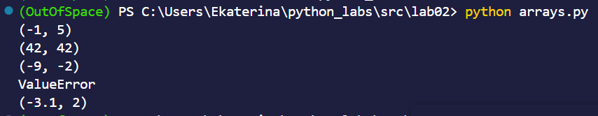
#### 1.2
```python
def unique_sorted(nums: list[float | int]) -> list[float | int]:
   return sorted(set(nums))
print(unique_sorted([3, 1, 2, 1, 3]))
print(unique_sorted([]))
print(unique_sorted([-1, -1, 0, 2, 2]))
print(unique_sorted([1.0, 1, 2.5, 2.5, 0]))
```
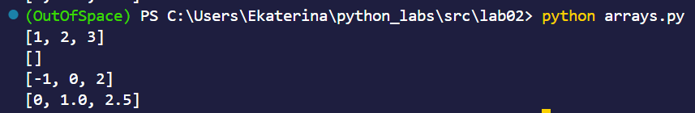
#### 1.3
```python
def flatten(matrix: list[list | tuple]) -> list:
    retlist = []
    for i in matrix:
        for j in i:
            if str(j) in "0123456789": retlist.append(j)
            else: return "TypeError"
    return retlist
print(flatten([[1, 2], [3, 4]]))
print(flatten([[1, 2], (3, 4, 5)]))
print(flatten([[1], [], [2, 3]]))
print(flatten([[1, 2], "ab"]))
```

### Задание 2 (matrix.py)
### 2.1
```python
def transpose(mat: list[list[float | int]]) -> list[list]:
    if mat == []: return []
    if any(len(mat[i])!=len(mat[0]) for i in range(len(mat))): return "ValueError"
    return [[mat[j][i] for j in range(len(mat))] for i in range(len(mat[0]))]
print(transpose([[1, 2, 3]]))
print(transpose([[1], [2], [3]]))
print(transpose([[1, 2], [3, 4]]))
print(transpose([]))
print(transpose([[1, 2], [3]]))
```
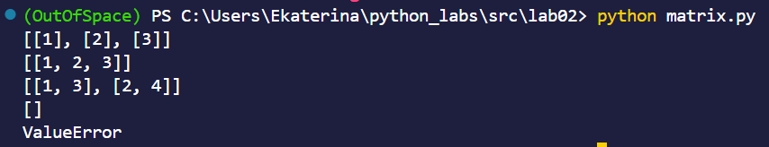
### 2.2
```python
def row_sums(mat: list[list[float | int]]) -> list[list]:
    if any(len(mat[i])!=len(mat[0]) for i in range(len(mat))): return "ValueError"
    retlist = []
    for i in range(len(mat)):
        retlist.append(sum(mat[i]))
    return retlist
print(row_sums([[1, 2, 3], [4, 5, 6]]))
print(row_sums([[-1, 1], [10, -10]]))
print(row_sums([[0, 0], [0, 0]]))
print(row_sums([[1, 2], [3]]))
```
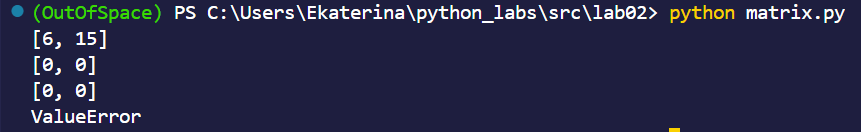
### 2.3
```python
def col_sums(mat: list[list[float | int]]) -> list[list]:
    if any(len(mat[i])!=len(mat[0]) for i in range(len(mat))): return "ValueError"
    retlist = []
    for i in range(len(mat[0])):
        retlist.append(0)
        for j in range(len(mat)):
            retlist[i]+=mat[j][i]
    return retlist
print(col_sums([[1, 2, 3], [4, 5, 6]]))
print(col_sums([[-1, 1], [10, -10]]))
print(col_sums([[0, 0], [0, 0]]))
print(col_sums([[1, 2], [3]]))
```
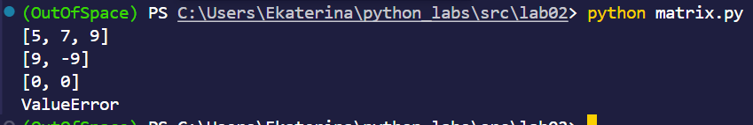
### Задание 3 (tuples.py)
```python
def format_record(rec: tuple[str, str, float]) -> str:
    if isinstance(rec, tuple) == False: return "TypeError"
    if rec[1]=="" or len(rec)!=3: return "ValueError"
    if rec[0]!=str(rec[0]) or rec[1]!=str(rec[1]) or rec[2]!=float(rec[2]) or len(str(rec[2]))!=len(str(float(rec[2]))): return "TypeError"
    retstr = ""
    sample_1 = rec[0].strip().title().split()
    if len(sample_1)==2: retstr += sample_1[0] + ' ' + sample_1[1][0] + '., '
    elif len(sample_1)==3: retstr += sample_1[0] + ' ' + sample_1[1][0] + '.' + sample_1[2][0] + '., '
    else: return "ValueError"
    retstr += f"гр. {rec[1]}, GPA {rec[2]:.2f}" 
    return retstr
print(format_record(("Иванов Иван Иванович", "BIVT-25", 4.6)))
print(format_record(("Петров Пётр", "IKBO-12", 5.0)))
print(format_record(("Петров Пётр Петрович", "IKBO-12", 5.0)))
print(format_record(("  сидорова  анна   сергеевна ", "ABB-01", 3.999)))
```
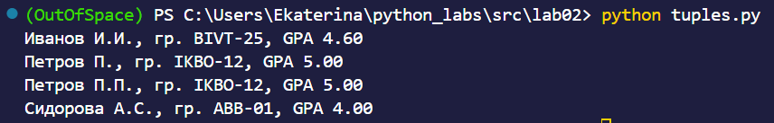

## Лабораторная номер 3
### Задание A
#### Код
```python
import re
def normalize(text: str, *, casefold: bool = True, yo2e: bool = True) -> str:
    if casefold == True: text = text.casefold()
    if yo2e == True: text = text.replace("ё", "е")
    for space in ['\n', '\t', '\r', '\v', '\f']:
        text = text.replace(space, ' ')
    return ' '.join(text.split())
def tokenize(text: str) -> list[str]:
    text = normalize(text)
    return re.findall(r'\w+(?:-\w+)*', text)
def count_freq(tokens: list[str]) -> dict[str, int]:
    unique = set(tokens)
    freq_dict = {}
    for text in unique:
        freq_dict [f'{text}'] = tokens.count(text)
    return freq_dict
def top_n(freq: dict[str, int], n: int = 5) -> list[tuple[str, int]]:
    dict_items_sorted = sorted(freq.items(), key=lambda x: (-x[1], x[0]))
    return dict_items_sorted[:n]
```
#### Тест кейсы + контрольные мини-тесты
```python
import sys
import os
src_root = os.path.abspath(os.path.join(os.path.dirname(__file__), '..'))
sys.path.insert(0, src_root)
from lib.text import normalize, tokenize, count_freq, top_n
# normalize
assert normalize("ПрИвЕт\nМИр\t") == "привет мир"
assert normalize("ёжик, Ёлка") == "ежик, елка"
assert normalize("Hello\r\nWorld") == "hello world"
assert normalize("  двойные   пробелы  ") == "двойные пробелы"
print("normalize function passed test")
# tokenize
assert tokenize("привет, мир!") == ["привет", "мир"]
assert tokenize("по-настоящему круто") == ["по-настоящему", "круто"]
assert tokenize("2025 год") == ["2025", "год"]
assert tokenize("emoji 😀 не слово") == ["emoji", "не", "слово"]
assert tokenize("hello,world!!!") == ["hello", "world"]
print("tokenize function passed test")
# count_freq + top_n
freq = count_freq(["a","b","a","c","b","a"])
assert freq == {"a":3, "b":2, "c":1}
assert top_n(freq, 2) == [("a",3), ("b",2)]
# тай-брейк по слову при равной частоте
freq2 = count_freq(["bb","aa","bb","aa","cc"])
assert top_n(freq2, 2) == [("aa",2), ("bb",2)]
print("count_freq + top_n functions passed test")
```
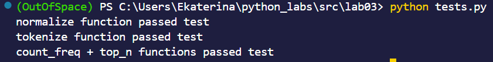
### Задание B
#### Код
```python
import sys
import os
src_root = os.path.abspath(os.path.join(os.path.dirname(__file__), '..'))
sys.path.insert(0, src_root)
from lib.text import normalize, tokenize, count_freq, top_n

def main():
    text = sys.stdin.readline().strip()
    if not text:
        print('Всего слов: 0')
        print('Уникальных слов: 0')
        print('Топ-5:')
        return
    print(f'Всего слов: {len(tokenize(text))}')
    print(f'Уникальных слов: {len(count_freq(tokenize(text)))}')
    print('Топ-5:')
    for variable, freq in top_n(count_freq(tokenize(text)), 5):
        print(f'      {variable}:    {freq}')
main()
```
#### Несколько примеров
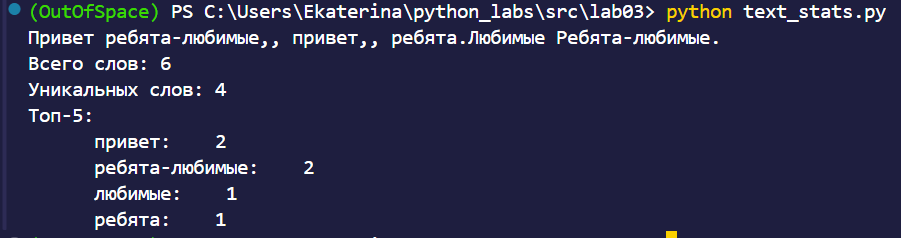
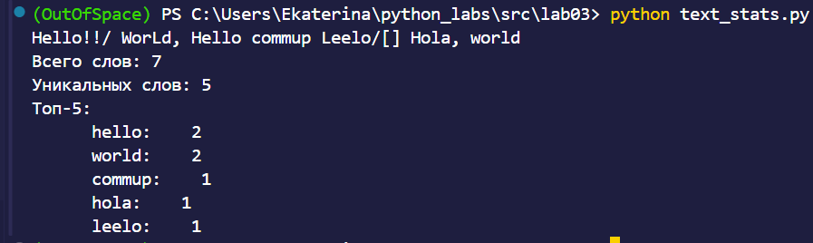

## Лабораторная номер 4
### Пояснение кодировок
По умолчанию используется UTF-8
Для файлов в других кодировках используйте параметр --encoding:
    --encoding cp1251 для Windows-1251 (русская)
    --encoding koi8-r для KOI8-R
При ошибке кодировки программа предложит указать правильную кодировку
### Политика пустого входа
1.Чтение файла: Функция read_text() возвращает пустую строку ""
2.Токенизация: Функция tokenize("") возвращает пустой список []
3.Подсчёт частот: count_freq([]) возвращает пустой словарь {}
4.Вывод в консоль
### Команды запуска
#### Запуск с параметрами по умолчанию
```python
python src/lab04/text_report.py
```
#### Запуск с указанием входного файла
```python
python src/lab04/text_report.py --in data/lab04/input.txt
```
#### Запуска с указанием входного и выходного файлов
```python
python src/lab04/text_report.py --in data/lab04/input.txt --out data/lab04/report.csv
```
#### Запуск с другой выборочной кодировкой
```python
python src/lab04/text_report.py --in data/lab04/input.txt --encoding cp1251
```

## Лабораторная номер 5
### Команды запуска
#### Инсталляция
```python
pip install openpyxl
```
Установка openpyxl
#### Запуск фунций (методов)
```python
python test_lab05.py
```
Все тесты были проведены в одном файле для удовства, 
все ошибки в случае чего будут выведены в терминал
#### Requirments
Был создан файл requirments.txt для указания зависимости.
#### Сам запуск
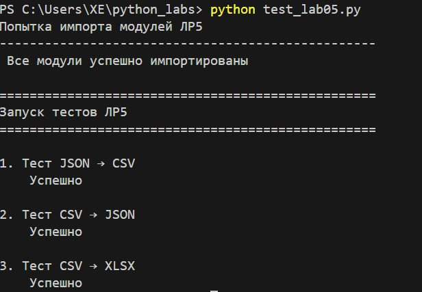
### Общие пояснения по проделанной работе
Были произведены конвертации между тремя популярными форматами: json, csv, xlsx.
#### Сценарии демонстрации
##### JSON -> CSV
Каждый объект в JSON → строка в CSV
Ключи объектов → заголовки столбцов
Значения → данные в ячейках
Порядок колонок: алфавитный (age, city, name)
Кодировка UTF-8
##### CSV -> JSON
Заголовок CSV → ключи в JSON
Каждая строка данных → объект в списке
Все значения становятся строками (даже числа)
Форматирование с отступами для удобного чтения
##### CSV -> XLSX
Весь CSV файл копируется в Excel
Ширина колонок настраивается автоматически
Если текст короткий → ширина 8 символов
Если текст длинный → ширина подбирается по содержимому
Сохраняется русская кодировка
#### Файлы для работы
Исходные файлы в папке data/samples
Выходные файлы в папке data/out
### Результаты в скриншотах
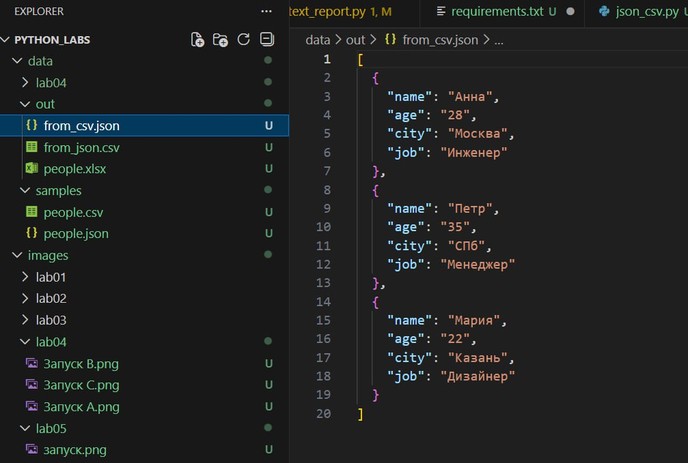
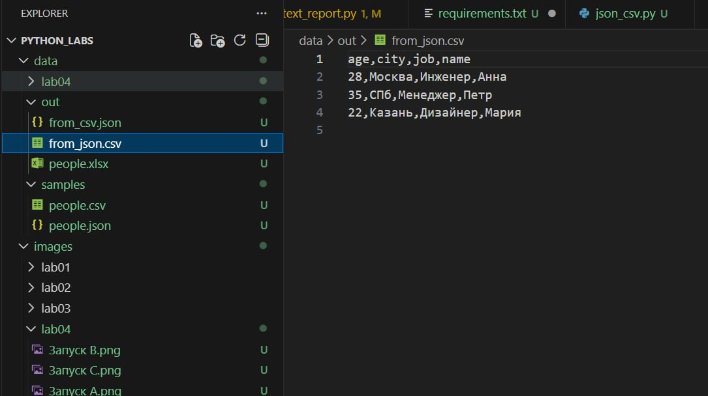
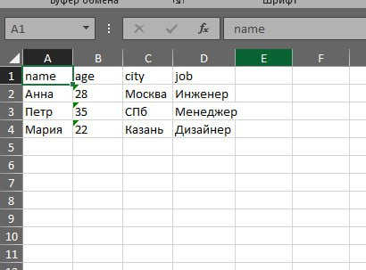