## Лабораторная номер 1
### Задание 1
```python
name = str(input())
age = int(input())
print(f'Привет, {name}! Через год тебе будет {age+1}')
```

### Задание 2
```python
value1 = float(input("value1:   "))
value2 = float(input("value2:   "))
print(f'sum={round(value1+value2, 2)}; avg={round((value1+value2)/2, 2)}')
```

### Задание 3
```python
price = float(input("Price: "))
discount = float(input("Discount: "))
vat = float(input("Vat: "))
base = price * (1-discount/100)
vat_amount = base * (vat/100)
total = base + vat_amount
print(f'База после скидки: {base:.2f}')
print(f'НДС: {vat_amount:.2f}')
print(f'Итого к оплате: {total:.2f}')
```

### Задание 4
```python
time1 = int(input("Введите минуты:\t"))
time_hours = time1//60
time_minutes = time1-(60*time_hours)
print(f'{time_hours}:{time_minutes}')
```

### Задание 5
```python
second_name, first_name, third_name = map(str, input("ФИО: ").split())
print(f'Инициалы: {second_name[0]+first_name[0]+third_name[0]}')
print(f'Длина (символов): {2+len(second_name)+len(first_name)+len(third_name)}')
```

### Задание 6
```python
n = int(input("in_1: "))
och, zaoch = 0, 0
for i in range(n):
    sname, fname, age, problem = map(str, input("in_"+str(i+2)+": ").split()) 
    if problem == "True": och+=1
    else: zaoch += 1
print(f'out: {och} {zaoch}')
```


## Лабораторная номер 2
### Задание 1 (arrays.py)
#### 1.1
```python
def min_max(nums: list[float | int]) -> tuple[float | int, float | int]:
    if nums == []: return "ValueError"
    rettuple = min(nums), max(nums)
    return rettuple
print(min_max([3, -1, 5, 5, 0]))
print(min_max([42]))
print(min_max([-5, -2, -9]))
print(min_max([]))
print(min_max([1.5, 2, 2.0, -3.1]))
```

#### 1.2
```python
def unique_sorted(nums: list[float | int]) -> list[float | int]:
   return sorted(set(nums))
print(unique_sorted([3, 1, 2, 1, 3]))
print(unique_sorted([]))
print(unique_sorted([-1, -1, 0, 2, 2]))
print(unique_sorted([1.0, 1, 2.5, 2.5, 0]))
```

#### 1.3
```python
def flatten(matrix: list[list | tuple]) -> list:
    retlist = []
    for i in matrix:
        for j in i:
            if str(j) in "0123456789": retlist.append(j)
            else: return "TypeError"
    return retlist
print(flatten([[1, 2], [3, 4]]))
print(flatten([[1, 2], (3, 4, 5)]))
print(flatten([[1], [], [2, 3]]))
print(flatten([[1, 2], "ab"]))
```

### Задание 2 (matrix.py)
### 2.1
```python
def transpose(mat: list[list[float | int]]) -> list[list]:
    if mat == []: return []
    if any(len(mat[i])!=len(mat[0]) for i in range(len(mat))): return "ValueError"
    return [[mat[j][i] for j in range(len(mat))] for i in range(len(mat[0]))]
print(transpose([[1, 2, 3]]))
print(transpose([[1], [2], [3]]))
print(transpose([[1, 2], [3, 4]]))
print(transpose([]))
print(transpose([[1, 2], [3]]))
```

### 2.2
```python
def row_sums(mat: list[list[float | int]]) -> list[list]:
    if any(len(mat[i])!=len(mat[0]) for i in range(len(mat))): return "ValueError"
    retlist = []
    for i in range(len(mat)):
        retlist.append(sum(mat[i]))
    return retlist
print(row_sums([[1, 2, 3], [4, 5, 6]]))
print(row_sums([[-1, 1], [10, -10]]))
print(row_sums([[0, 0], [0, 0]]))
print(row_sums([[1, 2], [3]]))
```

### 2.3
```python
def col_sums(mat: list[list[float | int]]) -> list[list]:
    if any(len(mat[i])!=len(mat[0]) for i in range(len(mat))): return "ValueError"
    retlist = []
    for i in range(len(mat[0])):
        retlist.append(0)
        for j in range(len(mat)):
            retlist[i]+=mat[j][i]
    return retlist
print(col_sums([[1, 2, 3], [4, 5, 6]]))
print(col_sums([[-1, 1], [10, -10]]))
print(col_sums([[0, 0], [0, 0]]))
print(col_sums([[1, 2], [3]]))
```

### Задание 3 (tuples.py)
```python
def format_record(rec: tuple[str, str, float]) -> str:
    if isinstance(rec, tuple) == False: return "TypeError"
    if rec[1]=="" or len(rec)!=3: return "ValueError"
    if rec[0]!=str(rec[0]) or rec[1]!=str(rec[1]) or rec[2]!=float(rec[2]) or len(str(rec[2]))!=len(str(float(rec[2]))): return "TypeError"
    retstr = ""
    sample_1 = rec[0].strip().title().split()
    if len(sample_1)==2: retstr += sample_1[0] + ' ' + sample_1[1][0] + '., '
    elif len(sample_1)==3: retstr += sample_1[0] + ' ' + sample_1[1][0] + '.' + sample_1[2][0] + '., '
    else: return "ValueError"
    retstr += f"гр. {rec[1]}, GPA {rec[2]:.2f}" 
    return retstr
print(format_record(("Иванов Иван Иванович", "BIVT-25", 4.6)))
print(format_record(("Петров Пётр", "IKBO-12", 5.0)))
print(format_record(("Петров Пётр Петрович", "IKBO-12", 5.0)))
print(format_record(("  сидорова  анна   сергеевна ", "ABB-01", 3.999)))
```


## Лабораторная номер 3
### Задание A
#### Код
```python
import re
def normalize(text: str, *, casefold: bool = True, yo2e: bool = True) -> str:
    if casefold == True: text = text.casefold()
    if yo2e == True: text = text.replace("ё", "е")
    for space in ['\n', '\t', '\r', '\v', '\f']:
        text = text.replace(space, ' ')
    return ' '.join(text.split())
def tokenize(text: str) -> list[str]:
    text = normalize(text)
    return re.findall(r'\w+(?:-\w+)*', text)
def count_freq(tokens: list[str]) -> dict[str, int]:
    unique = set(tokens)
    freq_dict = {}
    for text in unique:
        freq_dict [f'{text}'] = tokens.count(text)
    return freq_dict
def top_n(freq: dict[str, int], n: int = 5) -> list[tuple[str, int]]:
    dict_items_sorted = sorted(freq.items(), key=lambda x: (-x[1], x[0]))
    return dict_items_sorted[:n]
```
#### Тест кейсы + контрольные мини-тесты
```python
import sys
import os
src_root = os.path.abspath(os.path.join(os.path.dirname(__file__), '..'))
sys.path.insert(0, src_root)
from lib.text import normalize, tokenize, count_freq, top_n
# normalize
assert normalize("ПрИвЕт\nМИр\t") == "привет мир"
assert normalize("ёжик, Ёлка") == "ежик, елка"
assert normalize("Hello\r\nWorld") == "hello world"
assert normalize("  двойные   пробелы  ") == "двойные пробелы"
print("normalize function passed test")
# tokenize
assert tokenize("привет, мир!") == ["привет", "мир"]
assert tokenize("по-настоящему круто") == ["по-настоящему", "круто"]
assert tokenize("2025 год") == ["2025", "год"]
assert tokenize("emoji 😀 не слово") == ["emoji", "не", "слово"]
assert tokenize("hello,world!!!") == ["hello", "world"]
print("tokenize function passed test")
# count_freq + top_n
freq = count_freq(["a","b","a","c","b","a"])
assert freq == {"a":3, "b":2, "c":1}
assert top_n(freq, 2) == [("a",3), ("b",2)]
# тай-брейк по слову при равной частоте
freq2 = count_freq(["bb","aa","bb","aa","cc"])
assert top_n(freq2, 2) == [("aa",2), ("bb",2)]
print("count_freq + top_n functions passed test")
```

### Задание B
#### Код
```python
import sys
import os
src_root = os.path.abspath(os.path.join(os.path.dirname(__file__), '..'))
sys.path.insert(0, src_root)
from lib.text import normalize, tokenize, count_freq, top_n

def main():
    text = sys.stdin.readline().strip()
    if not text:
        print('Всего слов: 0')
        print('Уникальных слов: 0')
        print('Топ-5:')
        return
    print(f'Всего слов: {len(tokenize(text))}')
    print(f'Уникальных слов: {len(count_freq(tokenize(text)))}')
    print('Топ-5:')
    for variable, freq in top_n(count_freq(tokenize(text)), 5):
        print(f'      {variable}:    {freq}')
main()
```
#### Несколько примеров


## Лабораторная номер 4
### Пояснение кодировок
По умолчанию используется UTF-8
Для файлов в других кодировках используйте параметр --encoding:
    --encoding cp1251 для Windows-1251 (русская)
    --encoding koi8-r для KOI8-R
При ошибке кодировки программа предложит указать правильную кодировку
### Политика пустого входа
1.Чтение файла: Функция read_text() возвращает пустую строку ""
2.Токенизация: Функция tokenize("") возвращает пустой список []
3.Подсчёт частот: count_freq([]) возвращает пустой словарь {}
4.Вывод в консоль
### Команды запуска
#### Запуск с параметрами по умолчанию
```python
python src/lab04/text_report.py
```
#### Запуск с указанием входного файла
```python
python src/lab04/text_report.py --in data/lab04/input.txt
```
#### Запуска с указанием входного и выходного файлов
```python
python src/lab04/text_report.py --in data/lab04/input.txt --out data/lab04/report.csv
```
#### Запуск с другой выборочной кодировкой
```python
python src/lab04/text_report.py --in data/lab04/input.txt --encoding cp1251
```
### Запуски
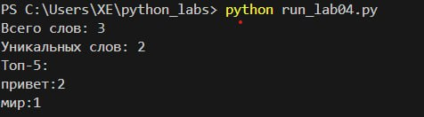
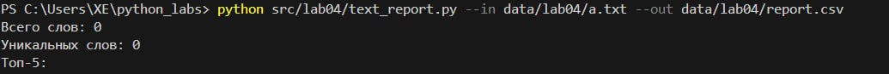


## Лабораторная номер 5
### Команды запуска
#### Инсталляция
```python
pip install openpyxl
```
Установка openpyxl
#### Запуск фунций (методов)
```python
python test_lab05.py
```
Все тесты были проведены в одном файле для удовства, 
все ошибки в случае чего будут выведены в терминал
#### Requirments
Был создан файл requirments.txt для указания зависимости.
#### Сам запуск

### Общие пояснения по проделанной работе
Были произведены конвертации между тремя популярными форматами: json, csv, xlsx
#### Сценарии демонстрации
##### JSON -> CSV
Каждый объект в JSON → строка в CSV
Ключи объектов → заголовки столбцов
Значения → данные в ячейках
Порядок колонок: алфавитный (age, city, name)
Кодировка UTF-8
##### CSV -> JSON
Заголовок CSV → ключи в JSON
Каждая строка данных → объект в списке
Все значения становятся строками (даже числа)
Форматирование с отступами для удобного чтения
##### CSV -> XLSX
Весь CSV файл копируется в Excel
Ширина колонок настраивается автоматически
Если текст короткий → ширина 8 символов
Если текст длинный → ширина подбирается по содержимому
Сохраняется русская кодировка
#### Файлы для работы
Исходные файлы в папке data/samples
Выходные файлы в папке data/out
### Результаты в скриншотах


## Лабораторная работа 6
### CLI_text
#### code
```python
import argparse
import sys
from pathlib import Path

PROJECT_ROOT = Path(__file__).parent.parent.parent
sys.path.insert(0, str(PROJECT_ROOT))

from src.lib.f_read_to_write import r_csv, r_json
from src.lib.text import top_n, count_freq, tokenize, normalize


def absoluting(path: Path | str) -> Path:
    path = Path(path)
    if not path.is_absolute():
        path = PROJECT_ROOT / path
    # if not path.exists():
    #     raise FileNotFoundError("Файл не найден")
    return path

PROJECT_ROOT = Path(__file__).parent.parent.parent
sys.path.insert(0, str(PROJECT_ROOT))


def main():
    parser = argparse.ArgumentParser(description="CLI")
    subparsers = parser.add_subparsers(dest="command")

    # подкоманда cat
    cat_parser = subparsers.add_parser("cat", help="Вывести содержимое файла")
    cat_parser.add_argument("-i", "--input", dest="input_file", required=True, help="Путь входного файла")
    cat_parser.add_argument("-n", action="store_true", help="Нумеровать строки")

    # подкоманда stats
    stats_parser = subparsers.add_parser("stats", help="Частоты слов")
    stats_parser.add_argument("-i", "--input", dest="input_file", required=True, help="Путь входного файла")
    stats_parser.add_argument("--top", dest="top_n", type=int, default=5, help="вывести топ-n слов по частоте")

    args = parser.parse_args()

    path = Path(args.input_file)
    if not path.is_absolute():
        path = PROJECT_ROOT / path
    print(path)

    if args.command == "cat":
        if not path.exists():
            raise FileNotFoundError("Указанный файл не найден")
        with open(path, "r", encoding="utf-8") as file:
            data = file.readlines()
            if args.n:
                for i in range(len(data)):
                    print(i + 1, data[i], end="")
            else:
                for i in range(len(data)):
                    print(data[i], end="")

    elif args.command == "stats":
        if not path.exists():
            raise FileNotFoundError("Указанный файл не найден")

        if path.suffix == ".csv":
            data = list(list(x.values()) for x in r_csv(path))
        elif path.suffix == ".json":
            data = data = list(list(x.values()) for x in r_json(path))
        elif path.suffix == ".txt":
            with open(path, "r", encoding="utf-8") as file:
                data = file.read()
        else:
            raise ValueError("Недопустимый формат файла")

        data = top_n(count_freq(tokenize(data)), args.top_n)
        if len(data) < args.top_n:
            n = len(data)
        else:
            n = args.top_n
        for num in range(n):
            print(f'{data[num][0]}: {data[num][1]}')


if __name__ == "__main__":
    main()
```
#### scrinshots
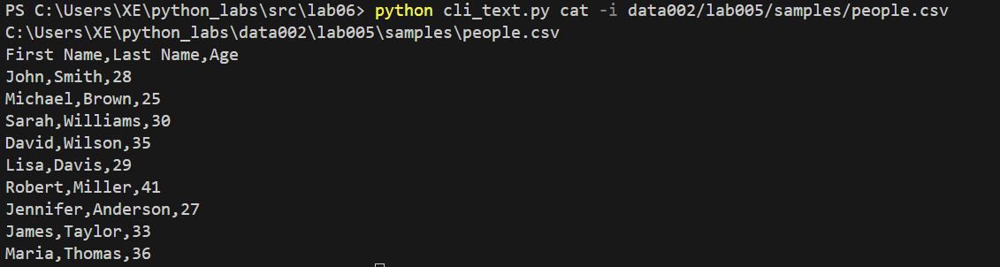
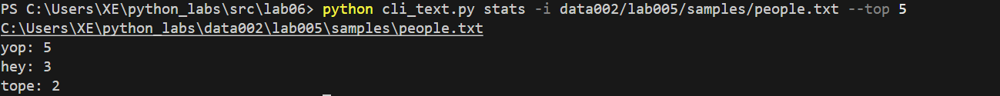
### CLI_converter
#### code
```python
import argparse
from pathlib import Path
import sys

PROJECT_ROOT = Path(__file__).parent.parent.parent
sys.path.insert(0, str(PROJECT_ROOT))
from src.lib.json_csv import json_to_csv, csv_to_json
from src.lib.csv_xlsx import csv_to_xlsx


def absoluting(path: Path | str) -> Path:
    path = Path(path)
    if not path.is_absolute():
        path = PROJECT_ROOT / path
    # if not path.exists():
    #     raise FileNotFoundError("Файл не найден")
    return path

def main():
    parser = argparse.ArgumentParser(description="Конвертеры данных")
    sub = parser.add_subparsers(dest="cmd")  # по умолчанию активируется при запуске кода. прописывать не нужно

    p1 = sub.add_parser("json2csv", help="конвертация json to csv")  # Необходимо прописывать после импорта файла
    p1.add_argument("-i","--input",dest="input_file",help="Входной файл .json",required=True,type=str,)
    p1.add_argument("-o", "--output", dest="output_file", help="Выходной .csv", required=True, type=str,)

    p2 = sub.add_parser("csv2json", help="конвертация csv to json")  # Необходимо прописывать после импорта файла
    p2.add_argument("-i","--input",dest="input_file",help="входной файл .csv",required=True,type=str,)
    p2.add_argument("-o","--output",dest="output_file",help="конечный файл .json",required=True,type=str,)

    p3 = sub.add_parser("csv2xlsx", help="конвертация csv to xlsx")  # Необходимо прописывать после импорта файла
    p3.add_argument("-i","--input",dest="input_file",help="входной файл .csv",required=True,type=str,)
    p3.add_argument("-o","--output",dest="output_file",help="выходной файл xlsx",required=True,type=str,)

    args = parser.parse_args()

    inf = absoluting(args.output_file)
    ouf = absoluting(args.input_file)

    if not ouf.is_file():
        parser.error(f"Указанный путь {ouf} не является файлом")

    if not inf.is_file():
        parser.error(f"Указанный путь {inf} не является файлом")

    if args.cmd == "json2csv":
        json_to_csv(absoluting(args.input_file), absoluting(args.output_file))

    if args.cmd == "csv2json":
        csv_to_json(absoluting(args.input_file), absoluting(args.output_file))

    if args.cmd == "csv2xlsx":
        csv_to_xlsx(absoluting(args.input_file), absoluting(args.output_file))


if __name__ == "__main__":
    main()
```
#### with using terminal
python cli_convert.py json2csv -i data002/lab005/samples/people.json -o data002/lab005/out/people_from_json.csv


python cli_convert.py csv2json -i data002/lab005/samples/people.csv -o data002/lab005/out/people_from_csv.json


python cli_convert.py csv2xlsx -i data002/lab005/samples/people.csv -o data002/lab005/out/people.xlsx

## Лабораторная работа 7
### test_text.py
```python
import pytest

from src.lib.text import count_freq, top_n, normalize, tokenize


@pytest.mark.parametrize(
    "source, expected",
    [
        ("ПрИвЕт\nМИр\t", "привет мир"),
        ("ёжик, Ёлки", "ежик, елки"),
        ("HeLlo\r\nWorld", "hello world"),
        ("  двойные      пробелы     ", "двойные пробелы"),
        ("", ""),
        ("\n\r\t", ""),
        ("123hello", "123hello"),
        ("123", "123"),
        ("www ssss", "www ssss"),
        ("Hi, new user!", "hi, new user!"),
        ("python_labs", "python_labs"),
    ],
)
def test_normalize_main(source: str, expected: str) -> None:
    assert normalize(source) == expected


def test_normalize_NO_yo2e() -> None:
    assert normalize("ёжик, Ёлки", yo2e=False) == "ёжик, ёлки"


@pytest.mark.parametrize(
    "source, expected",
    [
        ("Дарова      Ворлд", ["дарова", "ворлд"]),
        ("Hello my      project", ["hello", "my", "project"]),
        ("my world,Hello!!!!", ["my", "world", "hello"]),
        ("python_labs saved", ["python_labs", "saved"]),
        ("привет-пока, -пока-", ["привет-пока", "пока"]),
        ("hi!\nmi\ttoo.", ["hi", "mi", "too"]),
        (
            "7fw38rf3fgw7d_ysdufhsef-ef3 3-ffwsed    ef33_few33232",
            ["7fw38rf3fgw7d_ysdufhsef-ef3", "3-ffwsed", "ef33_few33232"],
        ),
        ("", []),
        ("%^&*()!@#$", []),
    ],
)
def test_tokenize(source: str, expected: str) -> None:
    assert tokenize(source) == expected


@pytest.mark.parametrize(
    "source, expected",
    [
        # (["a", "a", "you", "you", "b", "b", "YOU"], {'you': 3, 'b': 2, 'a': 2}),
        # (["Hello"], {'hello': 1}),
        (
            [
                "a",
                "a",
                "a",
                "a",
                "a",
                "a",
                "a",
            ],
            {'a': 7},
        ),
        (["a", "b", "c", "d", "e"], {'a': 1, 'b': 1, 'c': 1, 'd': 1, 'e': 1}),
        # (["12", "211", "12", "A", "a"], {'a': 2, '211': 1, '12': 2}),
        ([], {}),
    ],
)
def test_count_freq_main(source: str, expected: str) -> None:
    assert count_freq(source) == expected

@pytest.mark.parametrize(
    "source, expected",
    [
        ({'you': 3, 'b': 2, 'a': 2}, [('you', 3), ('a', 2), ('b', 2)]),
        ({'hello': 1}, [('hello', 1)]),
        ({'a': 7}, [('a', 7)]),
        (
            {'e': 1, 'd': 1, 'c': 1, 'b': 1, 'a': 1},
            [('a', 1), ('b', 1), ('c', 1), ('d', 1), ('e', 1)],
        ),
        ({'a': 2, '211': 1, '12': 2}, [('12', 2), ('a', 2), ('211', 1)]),
        ({}, []),
    ],
)
def test_top_n_main(source: str, expected: str) -> None:
    assert top_n(source) == expected
```
### test_json_csv.py
```python
import csv
import json
from pathlib import Path
import pytest

from src.lib.json_csv import csv_to_json, json_to_csv


def test_json_to_csv_basic(tmp_path: Path):
    start = tmp_path / "people.json"
    end = tmp_path / "people.csv"

    data = [
        {"Name": "Emily", "Surname": "Johnson", "Age": "24"},
        {"Name": "Daniel", "Surname": "Williams", "Age": "31"},
    ]
    start.write_text(json.dumps(data, ensure_ascii=False, indent=3), encoding="utf-8")
    json_to_csv(start, end)

    with end.open(encoding="utf-8") as f:
        rows = list(csv.DictReader(f))

    assert len(rows) == 2
    assert {"Name", "Surname", "Age"} <= set(rows[0].keys())
    assert rows[0]["Name"] == "Emily"
    assert rows[0]["Surname"] == "Johnson"
    assert rows[0]["Age"] == "24"
    assert rows[1]["Name"] == "Daniel"
    assert rows[1]["Surname"] == "Williams"
    assert rows[1]["Age"] == "31"


def test_json_to_csv_file_not_found(tmp_path: Path):
    src = tmp_path / "nonexistent.json"
    dst = tmp_path / "output.csv"

    with pytest.raises(FileNotFoundError):
        json_to_csv(str(src), str(dst))


def test_json_to_csv_multiple_fields(tmp_path: Path):
    src = tmp_path / "data.json"
    dst = tmp_path / "data.csv"

    data = [
        {"id": "1", "name": "Olegator", "city": "Moscow", "salary": "54000"},
        {"id": "2", "name": "Jane", "city": "Paris", "salary": "61200"},
        {"id": "3", "name": "Jack", "city": "London", "salary": "55300"},
    ]
    src.write_text(json.dumps(data, ensure_ascii=False, indent=2), encoding="utf-8")

    json_to_csv(str(src), str(dst))

    with dst.open(encoding="utf-8") as f:
        rows = list(csv.DictReader(f))

    assert len(rows) == 3
    assert {"id", "name", "city", "salary"} <= set(rows[0].keys())


def test_json_to_csv_cyrillic(tmp_path: Path):
    src = tmp_path / "russian.json"
    dst = tmp_path / "russian.csv"

    data = [
        {"имя": "Алексей", "возраст": "30"},
        {"имя": "Мария", "возраст": "28"},
    ]
    src.write_text(json.dumps(data, ensure_ascii=False, indent=2), encoding="utf-8")

    json_to_csv(str(src), str(dst))

    with dst.open(encoding="utf-8") as f:
        rows = list(csv.DictReader(f))

    assert len(rows) == 2
    assert rows[0]["имя"] == "Алексей"
    assert rows[1]["имя"] == "Мария"


def test_json_to_csv_invalid_json(tmp_path: Path):
    src = tmp_path / "invalid.json"
    dst = tmp_path / "output.csv"

    src.write_text("{ this is not valid json }", encoding="utf-8")

    with pytest.raises(ValueError):
        json_to_csv(str(src), str(dst))


def test_json_to_csv_empty_file(tmp_path: Path):
    src = tmp_path / "empty.json"
    dst = tmp_path / "output.csv"

    src.write_text("[]", encoding="utf-8")

    with pytest.raises(ValueError, match="Нет данных"):
        json_to_csv(str(src), str(dst))


# def test_json_to_csv_wrong_extension(tmp_path: Path):

#     src = tmp_path / "empty.txt"
#     dst = tmp_path / "output.csv"

#     with pytest.raises(TypeError, match="Неверный тип файла"):
#         json_to_csv(str(src), str(dst))


def test_json_to_csv_wrong_csv_extension(tmp_path: Path):
    src = tmp_path / "file.json"
    dst = tmp_path / "output.txt"

    src.write_text('[{"name": "test"}]', encoding="utf-8")

    with pytest.raises(TypeError, match="Неверный тип файла"):
        json_to_csv(str(src), str(dst))


def test_json_to_csv_memply(tmp_path: Path):
    src = tmp_path / "data.json"
    dst = tmp_path / "data.csv"

    data = []
    src.write_text(json.dumps(data, ensure_ascii=False, indent=2), encoding="utf-8")

    with pytest.raises(ValueError, match="Нет данных"):
        json_to_csv(str(src), str(dst))


def test_csv_to_json_basic(tmp_path: Path):

    src = tmp_path / "people.csv"
    dst = tmp_path / "people.json"

    with src.open("w", encoding="utf-8", newline="") as f:
        writer = csv.DictWriter(f, fieldnames=["name", "age"])
        writer.writeheader()
        writer.writerow({"name": "Alice", "age": "22"})
        writer.writerow({"name": "Bob", "age": "25"})

    csv_to_json(str(src), str(dst))

    with dst.open(encoding="utf-8") as f:
        data = json.load(f)

    assert len(data) == 2
    assert data[0]["name"] == "Alice"
    assert data[0]["age"] == "22"
    assert data[1]["name"] == "Bob"
    assert data[1]["age"] == "25"


def test_csv_to_json_multiple_fields(tmp_path: Path):
    src = tmp_path / "data.csv"
    dst = tmp_path / "data.json"

    with src.open("w", encoding="utf-8", newline="") as f:
        writer = csv.DictWriter(f, fieldnames=["id", "name", "city", "salary"])
        writer.writeheader()
        writer.writerow(
            {"id": "1", "name": "John", "city": "Moscow", "salary": "50000"}
        )
        writer.writerow({"id": "2", "name": "Jane", "city": "Paris", "salary": "60000"})

    csv_to_json(str(src), str(dst))

    with dst.open(encoding="utf-8") as f:
        data = json.load(f)

    assert len(data) == 2
    assert set(data[0].keys()) == {"id", "name", "city", "salary"}


def test_csv_to_json_cyrillic(tmp_path: Path):
    src = tmp_path / "russian.csv"
    dst = tmp_path / "russian.json"

    with src.open("w", encoding="utf-8", newline="") as f:
        writer = csv.DictWriter(f, fieldnames=["имя", "возраст"])
        writer.writeheader()
        writer.writerow({"имя": "Алексей", "возраст": "30"})
        writer.writerow({"имя": "Мария", "возраст": "28"})

    csv_to_json(str(src), str(dst))

    with dst.open(encoding="utf-8") as f:
        data = json.load(f)

    assert len(data) == 2
    assert data[0]["имя"] == "Алексей"
    assert data[1]["имя"] == "Мария"


def test_csv_to_json_file_not_found(tmp_path: Path):
    src = tmp_path / "nonexistent.csv"
    dst = tmp_path / "output.json"

    with pytest.raises(FileNotFoundError):
        csv_to_json(str(src), str(dst))


def test_csv_to_json_empty_file(tmp_path: Path):
    src = tmp_path / "empty.csv"
    dst = tmp_path / "output.json"

    src.write_text("", encoding="utf-8")

    with pytest.raises(ValueError, match="пуст"):
        csv_to_json(str(src), str(dst))


def test_csv_to_json_only_header(tmp_path: Path):
    src = tmp_path / "header_only.csv"
    dst = tmp_path / "output.json"

    with src.open("w", encoding="utf-8", newline="") as f:
        writer = csv.DictWriter(f, fieldnames=["name", "age"])
        writer.writeheader()

    with pytest.raises(ValueError, match="Нет данных"):
        csv_to_json(str(src), str(dst))


# def test_csv_to_json_wrong_extension(tmp_path: Path):

#     src = tmp_path / "file.txt"
#     dst = tmp_path / "output.json"

#     with pytest.raises(TypeError, match="Неверный тип файла"):
#         csv_to_json(str(src), str(dst))


def test_csv_to_json_wrong_json_extension(tmp_path: Path):
    src = tmp_path / "file.csv"
    dst = tmp_path / "output.txt"

    src.write_text("name,age\ntest,25", encoding="utf-8")

    with pytest.raises(TypeError, match="Неверный тип файла"):
        csv_to_json(str(src), str(dst))

```
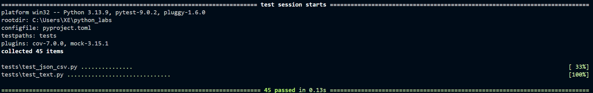
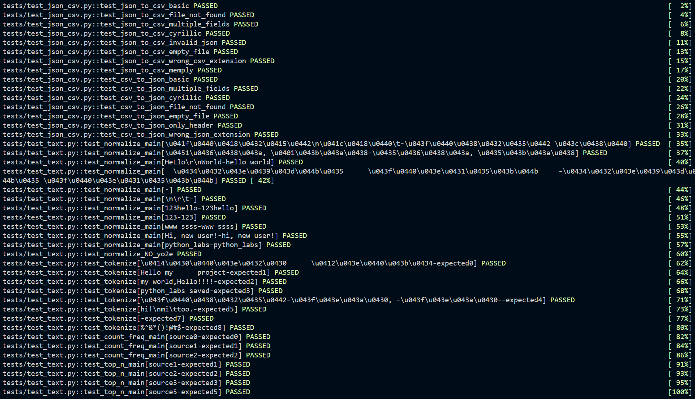
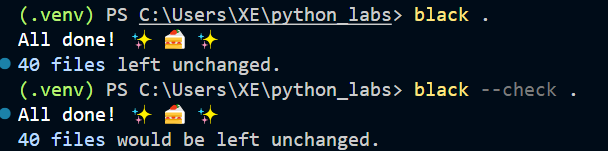

## Лабораторная работа 8
### models.py
```python
from dataclasses import dataclass
from datetime import date, datetime


@dataclass
class Student:

    fio: str
    birthdate: str
    group: str
    gpa: float

    def __post_init__(self):

        if not self.birthdate or self.birthdate == "" or self.birthdate == None:
            raise ValueError("Поле birthday не может быть пустым.")
        if not self.fio or self.fio == "" or self.fio == None:
            raise ValueError("Поле fio не может быть пустым.")
        if not self.group or self.group == "" or self.group == None:
            raise ValueError("Поле group не может быть пустым")

        try:

            life_years = datetime.strptime(self.birthdate, "%d.%m.%Y").date()

            if life_years > date.today():
                raise ValueError("Вперед в прошлое")
            if (date.today() - life_years).days / 365 > 120:
                raise ValueError("Вы существуете?")
        except ValueError as errors:
            if "warning: birthdate format might be invalid" in str(errors):
                raise ValueError(
                    f"Неверный формат даты: {self.birthdate}. "
                    f"Ожидается формат DD.MM.YYYY"
                ) from errors

        if not self.gpa or self.gpa == "" or self.gpa == None:
            raise ValueError("Поле GPA не должно быть пустым")

        self.gpa = float(self.gpa)
        if type(self.gpa) != float:
            raise ValueError("GPA должен быть числом")
        if not (0 <= self.gpa <= 5):
            raise ValueError(f"Средний балл должен быть в диапазоне от 0 до 5")

    def age(self) -> int:
        birth_date = datetime.strptime(self.birthdate, "%d.%m.%Y").date()
        age = date.today().year - birth_date.year
        today = date.today()

        if today.month < birth_date.month or (
            today.month == birth_date.month and today.day < birth_date.day
        ):
            age -= 1
        return age

    def to_dict(self) -> dict:
        if not self.fio:
            raise ValueError("Строка fio не должна быть пустой")
        if not self.group:
            raise ValueError("Строка group не должна быть пустой")
        return {
            "fio": self.fio,
            "birthdate": self.birthdate,
            "group": self.group,
            "gpa": self.gpa,
        }

    @classmethod
    def from_dict(cls, d: dict):
        return cls(
            fio=d["fio"], birthdate=d["birthdate"], group=d["group"], gpa=d["gpa"]
        )

    def __str__(self):
        return f"{self.fio}, {self.group}, {self.gpa}"


if __name__ == "__main__":

    data = Student(
        fio="Нормов Норм Нормисов", birthdate="14.14.2000", group="NORM-25-6", gpa=4.3
    )
    print(data)

```
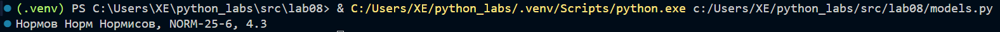
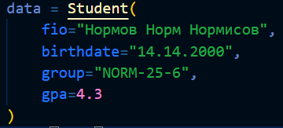
### serialize.py
```python 
import json
from pathlib import Path
from models import Student


def students_to_json(students, path: Path):
    data = [s.to_dict() for s in students]
    try:
        with open(path, "w", encoding="utf-8") as file:
            json.dump(data, file, ensure_ascii=False, indent=2)
    except IOError as error:
        raise IOError(f"Ошибка при записи файла: {error}")


def students_from_json(path: Path):
    path = Path(path)

    if path.suffix != ".json":
        raise TypeError("Неверный формат файла")

    try:
        with open(path, 'r', encoding="utf-8") as file:
            data = json.load(file)
    except FileNotFoundError:
        raise ValueError("Файл не найден")

    if not isinstance(data, list):
        raise ValueError("Должен быть список в файле")

    students = []

    for item in data:
        if not isinstance(item, dict):
            raise ValueError("Файл должен содержать список словарей")
        student = Student.from_dict(item)
        students.append(student)

    return students


if __name__ == "__main__":

    input_path = "data002/lab08/students_input.json"
    output_path = "data002/lab08/students_output.json"

    data = students_from_json(input_path)
    students_to_json(data, output_path)

    for infos in students_from_json(input_path):
        print(infos)

```
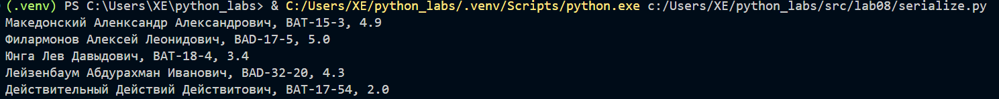
### JSON_input
```json
[
  {
    "fio": "Македонский Аленксандр Александрович",
    "birthdate": "13.12.2005",
    "group": "BAT-15-3",
    "gpa": 4.9
  },
  {
    "fio": "Филармонов Алексей Леонидович",
    "birthdate": "04.05.1990",
    "group": "BAD-17-5",
    "gpa": 5.0
  },
  {
    "fio": "Юнга Лев Давыдович",
    "birthdate": "11.07.2001",
    "group": "BAT-18-4",
    "gpa": 3.4
  },
  {
    "fio": "Лейзенбаум Абдурахман Иванович",
    "birthdate": "30.04.2005",
    "group": "BAD-32-20",
    "gpa": 4.3
  },
  {
    "fio": "Действительный Действий Действитович",
    "birthdate": "12.12.2000",
    "group": "BAT-17-54",
    "gpa": 2.0
  }
]
```
### JSON_output
Такой же..
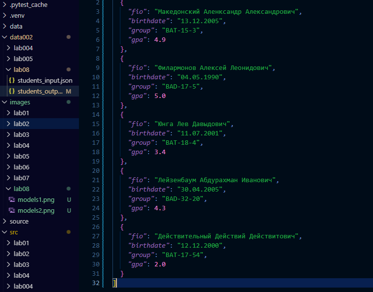

## Лабораторная работа 9
### group.py
```python
from pathlib import Path
from dataclasses import dataclass
from lib.text import normalize
from lib.f_read_to_write import r_csv
from lab08.models import Student
import csv

@dataclass
class Group:
    head=["fio", "birthdate", "group", "gpa"]
    path: Path
    def _ensure_storage_exists(self):
        self.path.write_text("", encoding="utf-8",newline="")
        with self.path.open("w",encoding="utf-8",newline="") as file:
            writer = csv.writer(file)
            writer.writerows(self.head)

    def __init__(self, storage_path: str):
        try:
            self.path = Path(storage_path)
        except:
            raise ValueError(" -- Path Error")
        if not self.path.exists():
            self._ensure_storage_exists()
            print(" -- no headers")

    def _read_all(self):
        all=r_csv(self.path)
        group=[]
        for student in all:
            group.append(Student.from_dict(student))
        return group

    def list(self):
        return self._read_all()

    def add(self, student: Student):
        with open(self.path, "a",encoding="utf-8",newline="") as file:
            writer=csv.writer(file)
            writer.writerow([student.fio,student.birthdate,student.group,student.gpa])
        return f"{student.fio} -- appended"

    def find(self, substr: str):
        rows=[]
        substr=normalize(substr).title()
        for student in self._read_all():
            rows.append(Student.to_dict(student))
        find_s=[r for r in rows if substr in r["fio"]] 
        if find_s==[]:
            return f"{substr} -- unfound"
        else:
            return find_s

    def remove(self, fio: str):
        if self.find(fio) ==  f"{fio} -- unfound":
            return f"{fio} -- unfound"
        else: fio = self.find(fio)[0]["fio"]
        students=self._read_all()
        clean_file=[r for r in students if r.fio != fio] 
        with open(self.path, "w",encoding="utf-8",newline="") as file:
            writer=csv.writer(file)
            writer.writerow(self.head)
            for student in clean_file:
                writer.writerow([student.fio,student.birthdate,student.group,student.gpa])
        return f"{fio} -- deleted"

    def update(self, fio: str, **fields):
        if self.find(fio) ==  f"{fio} -- unfound":
            return f"{fio} -- unfound"
        else: fio = self.find(fio)[0]["fio"]
        students=self._read_all()
        for s in students:
            if s.fio==fio:
                for key, data in fields.items():
                    setattr(s,key,data) #key from data to student
                break
        with open(self.path, "w",encoding="utf-8",newline="") as file:
            writer=csv.writer(file)
            writer.writerow(self.head)
            for student in students:
                writer.writerow([student.fio,student.birthdate,student.group,student.gpa])
        return f"{list(fields.keys()), fio} -- info is changed"

if __name__ == "__main__":
    student=Student(
        fio = "Нормов Норм Нормисов",
        birthdate = "16.09.2000",
        group = "NORM-25-6",
        gpa = 4.0
    )
    group=Group("data002/lab09/students.csv")

    print("Check list()")
    print(group.list(), "\n")
    print("Check _read_all()")
    print(group._read_all(), "\n")
    print(group.add(student=student), "\n")
    print("Check find()")
    print(group.find("Македонский Аленксандр Александрович"), "\n")
    print("Check remove()")
    print(group.remove("Македонский Аленксандр Александрович"), "\n")
    print("Check update()")
    print(group.update("Адекватный Адекват Адекватович",group = "BODD-14-33"))
```
### Проверка реализации методов
#### Проверка проводилась на данных из ЛР8 students_output.json, конвертированных в students.csv
```python 
from lib.json_csv import json_to_csv
json_to_csv("data002/lab08/students_output.json", "data002/lab09/students.csv")
```
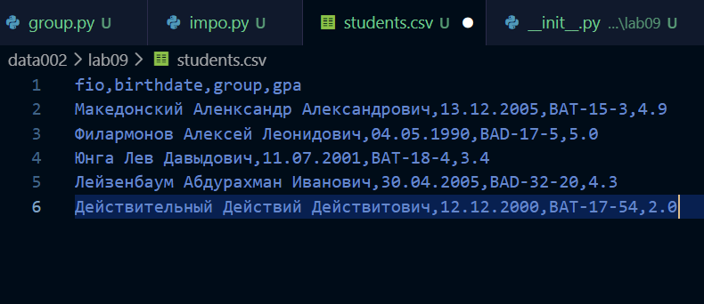
#### Проверка
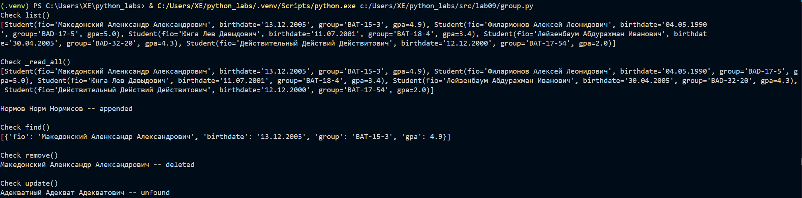