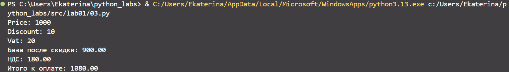

## Лабораторная номер 1
### Задание 1
```python
name = str(input())
age = int(input())
print(f'Привет, {name}! Через год тебе будет {age+1}')
```

### Задание 2
```python
value1 = float(input("value1:   "))
value2 = float(input("value2:   "))
print(f'sum={round(value1+value2, 2)}; avg={round((value1+value2)/2, 2)}')
```

### Задание 3
```python
price = float(input("Price: "))
discount = float(input("Discount: "))
vat = float(input("Vat: "))
base = price * (1-discount/100)
vat_amount = base * (vat/100)
total = base + vat_amount
print(f'База после скидки: {base:.2f}')
print(f'НДС: {vat_amount:.2f}')
print(f'Итого к оплате: {total:.2f}')
```

### Задание 4
```python
time1 = int(input("Введите минуты:\t"))
time_hours = time1//60
time_minutes = time1-(60*time_hours)
print(f'{time_hours}:{time_minutes}')
```

### Задание 5
```python
second_name, first_name, third_name = map(str, input("ФИО: ").split())
print(f'Инициалы: {second_name[0]+first_name[0]+third_name[0]}')
print(f'Длина (символов): {2+len(second_name)+len(first_name)+len(third_name)}')
```

### Задание 6
```python
n = int(input("in_1: "))
och, zaoch = 0, 0
for i in range(n):
    sname, fname, age, problem = map(str, input("in_"+str(i+2)+": ").split()) 
    if problem == "True": och+=1
    else: zaoch += 1
print(f'out: {och} {zaoch}')
```


## Лабораторная номер 2
### Задание 1 (arrays.py)
#### 1.1
```python
def min_max(nums: list[float | int]) -> tuple[float | int, float | int]:
    if nums == []: return "ValueError"
    rettuple = min(nums), max(nums)
    return rettuple
print(min_max([3, -1, 5, 5, 0]))
print(min_max([42]))
print(min_max([-5, -2, -9]))
print(min_max([]))
print(min_max([1.5, 2, 2.0, -3.1]))
```

#### 1.2
```python
def unique_sorted(nums: list[float | int]) -> list[float | int]:
   return sorted(set(nums))
print(unique_sorted([3, 1, 2, 1, 3]))
print(unique_sorted([]))
print(unique_sorted([-1, -1, 0, 2, 2]))
print(unique_sorted([1.0, 1, 2.5, 2.5, 0]))
```

#### 1.3
```python
def flatten(matrix: list[list | tuple]) -> list:
    retlist = []
    for i in matrix:
        for j in i:
            if str(j) in "0123456789": retlist.append(j)
            else: return "TypeError"
    return retlist
print(flatten([[1, 2], [3, 4]]))
print(flatten([[1, 2], (3, 4, 5)]))
print(flatten([[1], [], [2, 3]]))
print(flatten([[1, 2], "ab"]))
```

### Задание 2 (matrix.py)
### 2.1
```python
def transpose(mat: list[list[float | int]]) -> list[list]:
    if mat == []: return []
    if any(len(mat[i])!=len(mat[0]) for i in range(len(mat))): return "ValueError"
    return [[mat[j][i] for j in range(len(mat))] for i in range(len(mat[0]))]
print(transpose([[1, 2, 3]]))
print(transpose([[1], [2], [3]]))
print(transpose([[1, 2], [3, 4]]))
print(transpose([]))
print(transpose([[1, 2], [3]]))
```

### 2.2
```python
def row_sums(mat: list[list[float | int]]) -> list[list]:
    if any(len(mat[i])!=len(mat[0]) for i in range(len(mat))): return "ValueError"
    retlist = []
    for i in range(len(mat)):
        retlist.append(sum(mat[i]))
    return retlist
print(row_sums([[1, 2, 3], [4, 5, 6]]))
print(row_sums([[-1, 1], [10, -10]]))
print(row_sums([[0, 0], [0, 0]]))
print(row_sums([[1, 2], [3]]))
```

### 2.3
```python
def col_sums(mat: list[list[float | int]]) -> list[list]:
    if any(len(mat[i])!=len(mat[0]) for i in range(len(mat))): return "ValueError"
    retlist = []
    for i in range(len(mat[0])):
        retlist.append(0)
        for j in range(len(mat)):
            retlist[i]+=mat[j][i]
    return retlist
print(col_sums([[1, 2, 3], [4, 5, 6]]))
print(col_sums([[-1, 1], [10, -10]]))
print(col_sums([[0, 0], [0, 0]]))
print(col_sums([[1, 2], [3]]))
```

### Задание 3 (tuples.py)
```python
def format_record(rec: tuple[str, str, float]) -> str:
    if rec[1]=="" or len(rec)!=3: return "ValueError"
    if rec[0]!=str(rec[0]) or rec[1]!=str(rec[1]) or rec[2]!=float(rec[2]) or len(str(rec[2]))!=len(str(float(rec[2]))): return "TypeError"
    retstr = ""
    sample_1 = rec[0].strip().title().split()
    if len(sample_1)==2: retstr += sample_1[0] + ' ' + sample_1[1][0] + '., '
    elif len(sample_1)==3: retstr += sample_1[0] + ' ' + sample_1[1][0] + '.' + sample_1[2][0] + '., '
    else: return "ValueError"
    retstr += f"гр. {rec[1]}, GPA {rec[2]:.2f}" 
    return retstr
print(format_record(("Иванов Иван Иванович", "BIVT-25", 4.6)))
print(format_record(("Петров Пётр", "IKBO-12", 5.0)))
print(format_record(("Петров Пётр Петрович", "IKBO-12", 5.0)))
print(format_record(("  сидорова  анна   сергеевна ", "ABB-01", 3.999)))
```
